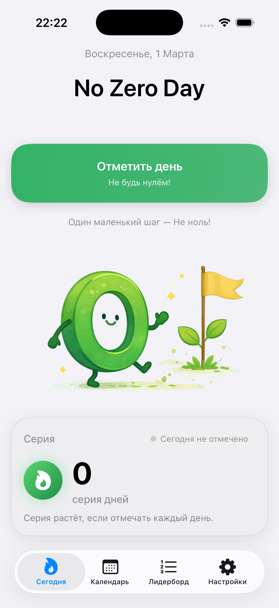
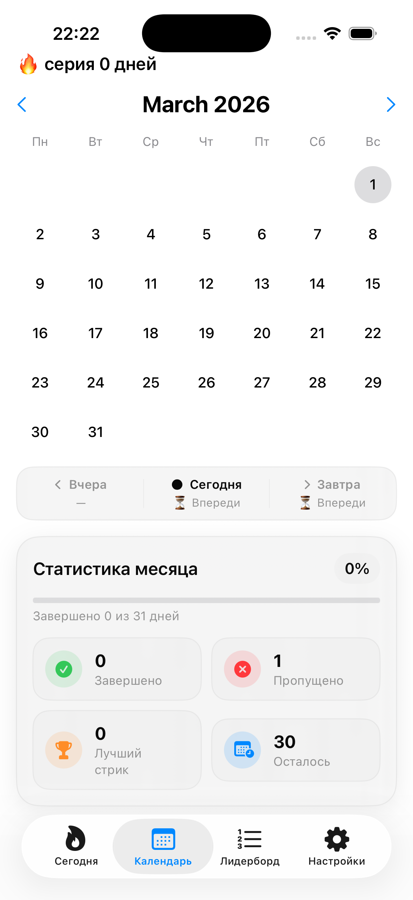
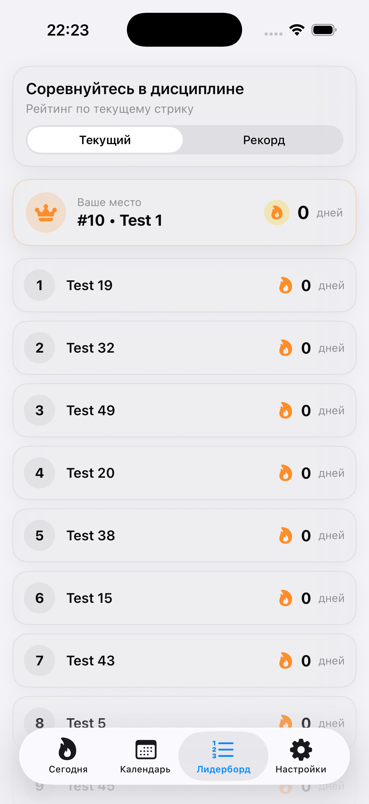
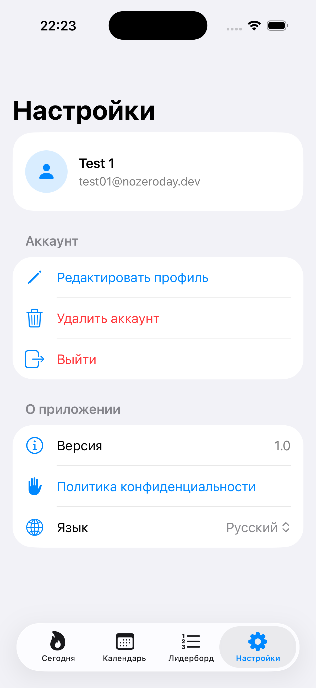

# 🚀 NoZeroDay

> Discipline over motivation.  
> An iOS productivity app built with SwiftUI to eliminate zero-progress days.

---

## 📱 Overview

**NoZeroDay** is a SwiftUI-based iOS application designed to help users build daily consistency through micro-task tracking.

The project focuses on clean architecture, structured state management, and persistent data handling.  
It demonstrates full-cycle mobile development — from UI design to data layer implementation.

---

## 🏗 Architecture

- MVVM (Model–View–ViewModel)
- Unidirectional data flow
- Reactive state-driven UI updates
- Encapsulated persistence layer
- Clean separation of concerns

The architecture is designed for scalability and maintainability.

---

## ⚙️ Core Technical Highlights

### 🔹 State Management
- SwiftUI property wrappers (`@State`, `@StateObject`, `@ObservedObject`)
- Dynamic task filtering (All / Active / Done)
- Derived state for efficient UI updates

### 🔹 Persistence Layer
- Centralized save/load logic
- JSON encoding & decoding for model serialization
- Error handling abstraction
- Persistent storage across app sessions

### 🔹 Performance Focus
- Lightweight data models
- Efficient list rendering
- Minimal view recomposition
- Optimized state updates

---

## ✨ Features

- Create and manage daily tasks
- Toggle completion state
- Task filtering system
- Persistent local storage
- Clean, minimal and distraction-free UI

---

## 🛠 Tech Stack

- Swift
- SwiftUI
- MVVM
- Combine (if applicable)
- Local persistence layer

---

## 🧠 Engineering Goals

This project was built to demonstrate:

- Practical SwiftUI implementation
- Structured architecture thinking
- Maintainable and scalable codebase
- Clear data flow management
- Product-oriented engineering mindset

---

## 🚀 Future Improvements

- Backend synchronization
- Cloud data storage
- Modularization
- Unit testing layer
- Performance benchmarking

---
## 📸 Screenshots

  
  
  
  

---
## 📌 Philosophy

NoZeroDay is more than a task tracker —  
it represents the mindset that small daily progress compounds into long-term growth.
